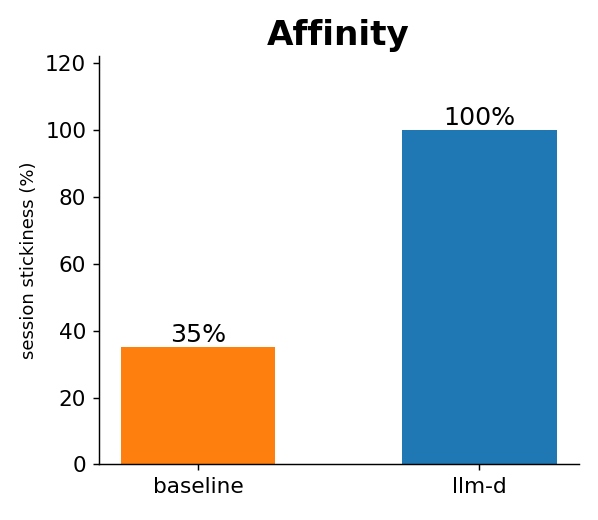
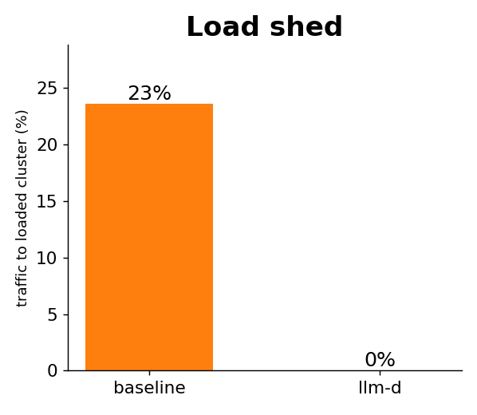
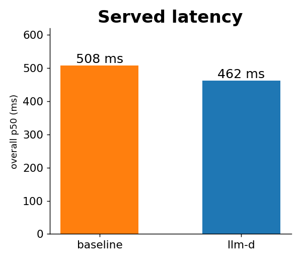

# Spoke-and-Hub: multi-cluster routing

A **hub** picks the **cluster**, each **spoke** picks the **pod**. Built on stock llm-d (one IPP code change).
No upstream multi-cluster guide exists; this is that scenario.

```
client -> hub Gateway -> [IPP-pre: MODEL] -> hub EPP: pick CLUSTER
       -> [IPP-post: pool credential] -> spoke Gateway -> spoke EPP: pick POD -> vLLM
```

## Scope

- **Multi-pool per cluster** - spoke demuxes `x-model` (`200 / 200 / 404`).
- **Hub consumes multiple per-pool metrics** from a manual list, isolated per pool.
- **`file-discovery` on stock v0.9.0** - ConfigMap endpoints, no proxy, no code.
- **Spoke gateway per-pool `/metrics`** - `gw:8080/metrics/<pool>` (validated under load).
- **Proxy-free e2e, per-pool** - `x-model` -> per-model file-discovery EPP -> ORIGINAL_DST -> spoke -> pod,
  **HTTP 200** for both model-a and model-b, no proxy. Config inventory + unwind: [`manifests/hub/FILE-DISCOVERY.md`](manifests/hub/FILE-DISCOVERY.md).

## Benchmark results

3-cluster, single k6 run, llm-d (hub EPP) vs round-robin baseline:

| Metric | baseline | llm-d |
|---|---|---|
| Affinity (session stickiness) | 35% | **100%** |
| Load shed (traffic to the loaded cluster) | 23% | **0%** |
| Served latency (p50) | 508ms | **462ms** |

| Affinity | Load shed | Served latency |
|---|---|---|
|  |  |  |


## Test

```bash
cluster-setup/up.sh                              # substrate
scripts/1-spokes.sh && scripts/2-hub.sh          # spokes + hub
scripts/3-auth.sh && scripts/4-ipp.sh            # auth (optional)
MODE=load     LOADED=1 benchmark/run.sh          # load-shed: traffic to the loaded cluster
MODE=affinity          benchmark/run.sh          # session stickiness
```
